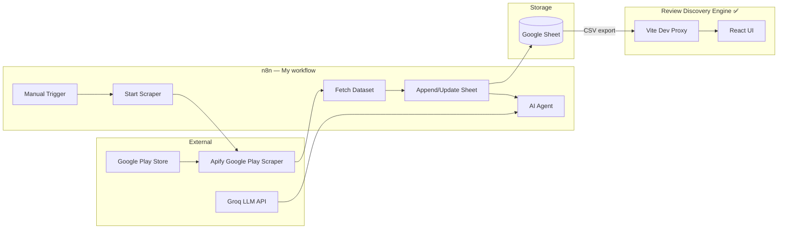
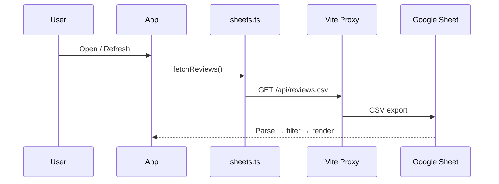

# NL - AI Review Engine · Architecture

Architecture for the **Review Discovery Engine**: an automated pipeline that ingests Google Play reviews, stores them in Google Sheets, and surfaces them for discovery and (planned) AI-powered theme analysis.

---

## Problem statement

The goal is a **repeatable, automated** pipeline — `ingest → cluster → theme → quantify` — not manual review skimming. Success is measured by a **working, testable system** grounded in real review data with traceable citations.

**What “done” means:**

| Stage | Status |
|-------|--------|
| Reviews land in Google Sheets via n8n scraping | **Implemented** |
| User can browse, search, and filter reviews in a UI | **Implemented** |
| Backend ingestion, dedupe, SQLite store | **Implemented** |
| Reviews embedded, clustered, and labeled as themes | **Implemented** |
| Themes quantified (volume, sentiment, trend) | **Implemented** |
| Chat interface with cited, grounded answers | **Implemented** |
| Scheduled pipeline refresh | **Implemented** (GitHub Actions) |
| Eval harness for routing + citations | **Implemented** |

---

## Objective

Build a lightweight **Review Discovery Engine** that:

- Treats the Google Sheet (fed by n8n) as the **system of record** for raw reviews.
- Runs a deterministic AI pipeline to convert raw reviews into structured, quantified **themes** — no manual tagging.
- Exposes themes and underlying reviews through search, dashboards, and (eventually) a Groq-powered chat interface.

---

## Scope & assumptions

| Area | Decision |
|------|----------|
| Data source | Single Google Sheet, single tab, appended by n8n. No other sources in this iteration. |
| Sheet | **NL Spotify review Scrapped data** — ID `1BL-09eLm61Zy3OLFxxqQVLf-I148dC30qbaKWa618wI`, tab `Sheet1` (gid `0`) |
| App / region | Spotify (`com.spotify.music`), India, up to 1000 reviews per scrape |
| Dedupe key | `id` (stable review ID from Google Play) |
| LLM | Groq — cluster labeling and chat answers (planned backend) |
| Embeddings | `sentence-transformers` locally (e.g. `bge-small-en-v1.5`) — Groq has no embedding API |
| Volume | Low hundreds to low thousands; refreshed on demand today (schedule planned) |
| Languages | English-primary; non-English flagged, not dropped |

---

## High-level architecture

### Current (implemented)



### Target (planned backend pipeline)

```
n8n → Google Sheet
         │
         ▼
┌─────────────────────────────────────────┐
│  INGESTION — Sheets API, normalize,     │
│  dedupe → SQLite/Postgres               │
└─────────────────┬───────────────────────┘
                  ▼
┌─────────────────────────────────────────┐
│  EMBEDDING + CLUSTERING — sentence-     │
│  transformers → Chroma → HDBSCAN        │
└─────────────────┬───────────────────────┘
                  ▼
┌─────────────────────────────────────────┐
│  THEMES + QUANTIFY — Groq labels        │
│  clusters; code computes volume/trends  │
└─────────────────┬───────────────────────┘
                  ▼
┌─────────────────────────────────────────┐
│  RAG CHAT + UI — FastAPI + React        │
│  theme dashboard, chat, drill-down      │
└─────────────────────────────────────────┘
```

Scheduled refresh (GitHub Actions or n8n cron) re-runs ingestion through theme updates incrementally and idempotently.

---

## Architectural principles

1. **Pipeline over vibes** — every theme and metric must trace to embed → cluster → label → aggregate.
2. **Two levels of truth** — *themes* (macro) and *reviews* (micro evidence). Chat never answers from a summary alone without review IDs.
3. **Idempotent refresh** — re-runs must not duplicate reviews or re-label unchanged clusters.
4. **LLM for language, not math** — counts, trends, and aggregates are computed in code; Groq names clusters and phrases chat answers.
5. **Citations mandatory** — factual chat claims must cite `review_id`, source, and date.
6. **Closed data source** — only the declared Google Sheet/tab is read.
7. **Auditability** — each pipeline run logs what was ingested, clustered, merged, and labeled.

---

## Data model

Google Sheets column schema (n8n output ↔ frontend `Review` type):

| Column | Type | Description |
|--------|------|-------------|
| `id` | string | Unique review ID (dedupe key) |
| `userName` | string | Reviewer display name |
| `userImage` | string | Avatar URL |
| `date` | string (ISO) | Review posted date |
| `score` | number | Star rating (1–5) |
| `scoreText` | string | Rating label from Play Store |
| `url` | string | Direct link to the review |
| `title` | string | Optional review title |
| `text` | string | Review body |
| `replyDate` | string (ISO) | Developer reply timestamp |
| `replyText` | string | Developer response body |
| `version` | string | App version reviewed |
| `thumbsUp` | number | Helpful vote count |
| `criterias` | string | Play Store criteria metadata |

**Planned theme schema:** `theme_id`, `label`, `description`, `sentiment_avg`, `review_count`, `first_seen`, `last_seen`, `status` (`active` \| `merged` \| `stale`).

---

## Ingestion pipeline (n8n) — implemented

**Workflow:** *My workflow* (`5MIReA91N2XGh8Nk`) · **Trigger:** manual

| Step | Node | Action |
|------|------|--------|
| 1 | HTTP Request | POST Apify `curious_coder~google-play-scraper` — scrape up to 1000 Spotify India reviews |
| 2 | HTTP Request1 | GET latest Apify dataset items |
| 3 | Append or update row in sheet | Upsert into Google Sheet, match on `id` |
| 4 | AI Agent | Groq Chat Model + Simple Memory + Chat tool (not yet exposed to frontend) |

Apify credentials should live in n8n credentials, not hardcoded in node URLs.

---

## Review Discovery Engine (frontend) — implemented

### Repository layout

```
nl-ai-review-engine/
├── architecture.md
├── README.md
├── .github/workflows/pipeline_refresh.yml
├── backend/
│   ├── app/
│   │   ├── api/routes.py        # FastAPI: /health, /refresh, /themes, /chat
│   │   ├── db/models.py         # SQLite models
│   │   ├── pipeline/            # Phases 1–4
│   │   └── rag/                 # Phase 5 chat + citations
│   ├── config/source_config.yaml
│   ├── scripts/                 # Phase 0 + Phase 8 eval
│   └── requirements.txt
└── frontend/
    ├── src/
    │   ├── App.tsx              # Themes & chat + review discovery views
    │   ├── components/          # ThemeDashboard, ChatPanel, review UI
    │   └── lib/api.ts           # Backend API client
    └── vite.config.ts
```

### Stack

React 19 · TypeScript · Vite 6 · PapaParse

### Data flow



### Configuration

| Variable | Purpose |
|----------|---------|
| `VITE_GOOGLE_SHEET_ID` | Spreadsheet ID |
| `VITE_GOOGLE_SHEET_GID` | Tab GID (default `0`) |
| `VITE_REVIEWS_CSV_URL` | Optional production CSV override |

### Current UI capabilities

- Stats: average rating, distribution, reply rate
- Search, star-rating filter, reply filter, sorting
- Review cards with developer replies and Play Store links
- Manual refresh from sheet

---

## Backend pipeline — implemented

| Phase | Purpose | Key outputs | Status |
|-------|---------|-------------|--------|
| **0** Governance | Sheet contract, config | `source_config.yaml`, `test_sheet_connection.py` | **Done** |
| **1** Ingestion | Incremental pull, normalize, dedupe | `reviews` SQLite store | **Done** |
| **2** Embedding + clustering | Vectors + HDBSCAN | `review_embeddings`, cluster labels | **Done** |
| **3** Theme labeling | Groq names/summarizes clusters | `themes` store | **Done** |
| **4** Quantification | Volume, sentiment, trend, severity | `theme_metrics` | **Done** |
| **5** RAG chat | Query router, retrieval, cited answers | `POST /api/v1/chat` | **Done** |
| **6** Frontend expansion | Theme dashboard + chat panel | React tabs wired to FastAPI | **Done** |
| **7** Scheduling | Cron refresh | `.github/workflows/pipeline_refresh.yml` | **Done** |
| **8** Eval + observability | Citation validator, logs | `scripts/run_eval.py`, `pipeline_runs`, `chat_logs` | **Done** |

### RAG chat flow (Phase 5)

```
Query → intent router → theme-level OR review-level retrieval
       → context assembler → Groq answer → citation validator → response
```

Out-of-scope questions (business decisions the data cannot support) get a polite refusal, not a guess.

### Target frontend layout (Phase 6)

```
┌─────────────────────────────────────────────────────┐
│  Review Discovery Engine                             │
├──────────────────┬──────────────────────────────────┤
│  Theme cards      │  Chat (cited answers)            │
│  trend, volume    │  "What are people complaining    │
│  click → reviews  │   about this week?"              │
└──────────────────┴──────────────────────────────────┘
```

Existing React app becomes the review drill-down layer; theme cards and chat are added alongside.

---

## Integration boundaries

| Integration | Direction | Protocol | Status |
|-------------|-----------|----------|--------|
| n8n → Apify | Outbound | REST | Live |
| n8n → Google Sheets | Outbound | Sheets API (OAuth) | Live |
| n8n → Groq | Outbound | Chat API | Live (in workflow only) |
| Frontend → Google Sheets | Inbound | CSV export | Live |
| Backend → Google Sheets | Inbound | Public CSV export | **Live** |
| Frontend → FastAPI | Inbound | REST | **Live** |

The frontend does **not** call n8n or Apify directly today.

---

## Suggested tech stack (backend — planned)

| Layer | Choice |
|-------|--------|
| Language | Python (pipeline) + React (UI) |
| Sheets | `gspread` + Google service account |
| Storage | SQLite (MVP) → Postgres |
| Embeddings | `sentence-transformers` (`bge-small-en-v1.5`) |
| Vector store | Chroma |
| Clustering | HDBSCAN |
| LLM | Groq (labeling + chat) |
| API | FastAPI (`/chat`, `/themes`, `/refresh`, `/health`) |
| Scheduler | GitHub Actions cron + `workflow_dispatch` |

---

## Development & deployment

### Run full stack

```bash
# Terminal 1 — backend
cd backend
python -m venv .venv
.venv\Scripts\activate   # Windows
pip install -r requirements.txt
python run_server.py

# Terminal 2 — frontend
cd frontend
npm install
npm run dev
```

Open `http://localhost:5173`. Use **Refresh pipeline** to run ingest → cluster → theme → quantify.

### Production considerations

| Concern | Today | Recommendation |
|---------|-------|----------------|
| CORS | Vite dev proxy | Server-side proxy or edge function |
| Sheet access | Public CSV export | Service account + backend for private data |
| Secrets | Apify token in n8n URL | n8n credentials + env vars |
| AI | n8n agent only | Expose via FastAPI or n8n webhook |

---

## Security

- Do not commit `frontend/.env`, API keys, or service account JSON.
- Apify and Groq keys belong in n8n credentials or backend env, not in repo or workflow URLs.
- Frontend is read-only against the sheet today.

---

## Risks & mitigations

| Risk | Mitigation |
|------|------------|
| n8n changes sheet columns | Schema contract in this doc; startup validation fails loudly on drift |
| Too many tiny themes at scale | Tune HDBSCAN `min_cluster_size`; merge pass on similar centroids |
| Groq hallucinates stats | Numbers from code only; labeler returns schema-validated JSON |
| Bad chat citations | Citation validator rejects unverifiable claims |
| Duplicate reviews on re-scrape | Upsert on `id` (n8n + planned hash dedupe in backend) |
| Non-English reviews skew clusters | Language flag in ingestion; exclude from clustering until multilingual model chosen |

---

## Current limitations

1. Manual n8n trigger only — scheduled scrape still depends on n8n activation.
2. Single app/region — Spotify India only.
3. Groq labeling/chat uses fallback heuristics when `GROQ_API_KEY` is not set.
4. Embeddings stored in SQLite rather than Chroma (same retrieval behavior at current scale).
5. All reviews loaded in browser memory — no pagination.

---

## Roadmap

| Phase | Outcome | Status |
|-------|---------|--------|
| 0 | Sheet schema locked, config | **Done** |
| 1 | Backend ingestion + dedupe store | **Done** |
| 2 | Embeddings + clustering | **Done** |
| 3 | Groq theme labeling | **Done** |
| 4 | Quantification + trends | **Done** |
| 5 | RAG chat with citations | **Done** |
| 6 | Theme dashboard + chat in UI | **Done** |
| 7 | Scheduled refresh | **Done** |
| 8 | Eval + observability | **Done** |
| — | n8n scrape → sheet pipeline | **Done** |
| — | React review discovery UI | **Done** |

---

## References

- **GitHub:** [barathankavin/nl-ai-review-engine](https://github.com/barathankavin/nl-ai-review-engine)
- **Google Sheet:** NL Spotify review Scrapped data (`1BL-09eLm61Zy3OLFxxqQVLf-I148dC30qbaKWa618wI`)
- **n8n workflow:** My workflow (`5MIReA91N2XGh8Nk`)
